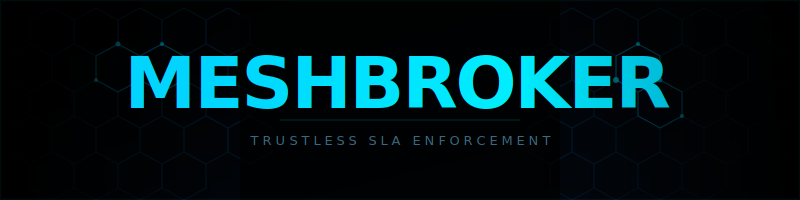

<div align="center">



<br/><br/>

**The trustless SLA enforcement layer for the agentic economy.**

When AI agents exchange value, someone has to be the sheriff.

[](https://www.oklink.com/xlayer-test)
[](https://x402.org)
[](https://python.org)
[](https://www.oklink.com/xlayer-test)

</div>

---

## What Is MeshBroker

MeshBroker is an onchain SLA enforcement layer for AI agent commerce. It is a smart contract protocol that sits between agents that pay for work and agents that perform work, guaranteeing that payment releases only when the job is cryptographically proven complete.

It is not a trading bot. It is not a chatbot wrapper. It is infrastructure — the trust primitive that every other agent project on X Layer needs but nobody has built.

---

## Why We Built It

The agentic economy has a fundamental unsolved problem.

Every major payment protocol in 2026 handles one thing beautifully: how do you initiate a payment to an AI agent? What none of them solve is what happens after the payment. How do you know the agent actually did the work? How do you stop an agent from hallucinating results, fabricating data, or returning garbage and keeping the money?

Right now, you cannot. Agents either operate on blind trust or they do not operate at all.

MeshBroker turns every agent interaction from a handshake into a contract, with automatic enforcement, cryptographic verification, and economic punishment for bad behavior.

---

## How It Works
```
BuyerAgent                 MeshBroker Contract             WorkerAgent
    |                             |                              |
    |---- createSLA() ----------->|                              |
    |     [lock USDT escrow]      |                              |
    |                             |<----- acceptSLA() -----------|
    |                             |       [stake USDT bond]      |
    |                             |                              |
    |                             |       [execute task]         |
    |                             |       [fetch live OKX data]  |
    |                             |                              |
    |                             |<----- submitProof(hash) -----|
    |                             |                              |
    |                      VerifierAgent                        |
    |                             |                              |
    |                      [verify hash independently]          |
    |                             |                              |
    |<--- SLASettled event -------|------ release USDT --------->|
    |                        OR   |                              |
    |<--- refund + slash ---------|      [stake to treasury]     |
```

Zero humans. Zero manual steps. The math enforces it.

The state machine is inviolable:
```
OPEN -> ACTIVE -> PROOF_SUBMITTED -> SETTLED
                                  -> SLASHED (stake to treasury, buyer refunded)
```

No agent can skip a step. No human can override it.

---

## The Five Layers

**SLA Enforcement Engine**
The core smart contract on X Layer. Handles escrow, staking, proof verification, settlement, and slashing. Every agent interaction flows through it.

**Bounty Race Engine**
Open task marketplace. Anyone posts a bounty with a USDT reward. Multiple worker agents compete to complete it first and correctly. The verifier picks the best cryptographically proven result. Winner gets paid. Losers get slashed. Runs live in terminal.

**x402 Atomic Payment Loop**
End-to-end x402 payment flow in a single script. Buyer approves USDT, locks escrow, worker fetches live OKX market data, submits proof onchain, verifier releases payment. Six transactions. Zero human steps. Live OKB price embedded in the proof.

**SLA Composer**
Plain English to deployed SLA spec in seconds. Type what you want done. Claude Haiku converts it into a structured JSON SLA with reward, deadline, and success criteria. Live chain state shown alongside, current block, escrow balance, treasury, all pulled from the actual contract. Available at localhost:7402.

**Agent Heartbeat and Registry**
Every agent gets a public trust page derived from immutable onchain events. Real uptime percentage. Real slash history. Real reputation score. No self-reported metrics. The Registry routes new bounties automatically to the highest-reputation agent for each task type.

---

## Live Transactions

All transactions verifiable at [oklink.com/xlayer-test](https://www.oklink.com/xlayer-test)

### Bounty Race

| Action | Transaction |
|--------|-------------|
| Post Bounty 1 | [32dc7734](https://www.okx.com/explorer/xlayer-test/tx/0x32dc7734084f1ef96ba03bb77a847ca0765d46433906e51c1301cd393e3d5240) |
| Alpha Accept and Proof | [46c6634f](https://www.okx.com/explorer/xlayer-test/tx/0x46c6634f8c9890267fc836966e73c18ed224604a01a30287192d25fbcc6f0254) |
| Alpha Settlement | [7d0c2e04](https://www.okx.com/explorer/xlayer-test/tx/0x7d0c2e04f842b038d23e8418a2e0a6d950f262c4de0aa99315a45a1301f69488) |
| Post Bounty 2 | [30914746](https://www.okx.com/explorer/xlayer-test/tx/0x30914746a9e87e6ece84feea9aea3377cbf0df8e4600103a183968aab9e1cd54) |
| Beta Accept and Proof | [004dd475](https://www.okx.com/explorer/xlayer-test/tx/0x004dd4757e967c12ba070c54354a9c1adb0c260bdb3e060822b2788e70e8c6b9) |

### x402 Atomic Payment Loop

| Action | Transaction |
|--------|-------------|
| Buyer USDT Approve | [167854db](https://www.okx.com/explorer/xlayer-test/tx/0x167854dba736462df860fa592b19014834f8104e17c8311da04e7f619b4a6845) |
| createSLA lock escrow | [f01c67f3](https://www.okx.com/explorer/xlayer-test/tx/0xf01c67f3b5e386982dba314a3ec1e3603c4c0d79dde39182b3ea4a6d6f0314d3) |
| Worker USDT Approve | [ab8fc55e](https://www.okx.com/explorer/xlayer-test/tx/0xab8fc55ec84e3b984abcfb5143edb4b395b84af253dd797bc35a79e4ab240020) |
| acceptSLA | [962cfaa5](https://www.okx.com/explorer/xlayer-test/tx/0x962cfaa5ca1de4cb36926e49911180e02c5a512418cea07ec1ba331ff6526ad6) |
| submitProof OKB 84.71 | [fe78dd2a](https://www.okx.com/explorer/xlayer-test/tx/0xfe78dd2afa1d28e5b702b2dd608ba2ef75cecff136261944158690d63d13942e) |
| verifyAndRelease | [d9235160](https://www.okx.com/explorer/xlayer-test/tx/0xd9235160a3cf517c6d39d33a2ad01baedf3f6a3dc87618c3cdb00e5d54da190b) |

### Agent Registry

| Action | Transaction |
|--------|-------------|
| Worker Registration | [2436d4fa](https://www.okx.com/explorer/xlayer-test/tx/0x2436d4facb021c9f2166c89784a723751ff9e19840afaa66f3cc33542912d77b) |

---

## Run It Yourself
```bash
git clone https://github.com/Vinaystwt/meshbroker-agents
cd meshbroker-agents
pip install web3 rich requests python-dotenv flask

cp .env.example .env

python3 demo/bounty_race.py

python3 demo/warroom.py

python3 agents/buyer_agent_x402.py

python3 composer_server.py

python3 scripts/generate_heartbeat.py && open heartbeat.html
```

---

## Why X Layer

A full MeshBroker SLA lifecycle costs less than 0.0002 USD in gas on X Layer. On Ethereum mainnet the same flow costs 8 to 40 USD. On Base, 0.05 to 2 USD. On X Layer, fractions of a cent.

This is the only chain where a zero-marginal-cost agent economy is viable today. The x402 protocol handles payment negotiation off-chain. X Layer handles settlement on-chain at near-zero cost. Together they make autonomous agent commerce economically feasible at any scale.

---

## Revenue Model

| Stream | Rate | Trigger |
|--------|------|---------|
| Protocol fee | 0.25% of SLA value | Every settlement |
| Slash treasury | 100% of slashed stake | Every failed verification |
| Registry listing | 0.1% of first payout | Every new agent registration |

---

## Roadmap

Multi-verifier consensus via decentralized oracle network, eliminating the single verifier trust assumption. SLA Template Marketplace with audited reusable specs for common agent task types. Cross-chain SLAs spanning X Layer, Ethereum, and Base via x402 bridging. AgentCredit providing reputation-backed undercollateralized credit lines for high-trust agents. MeshBroker SDK enabling three-line integration for any agent project.

---

## OKX Onchain OS APIs

| API | Integration |
|-----|-------------|
| Market API | Live OKB/USDT price embedded as cryptographic proof of work in every SLA |
| x402 Payments | Atomic USDT escrow lock and release |
| Wallet API | Balance queries and nonce management across all agents |

---

<div align="center">

Built for the OKX / X Layer Onchain OS AI Hackathon 2026

[@vinaystwt](https://twitter.com/vinaystwt)

MeshBroker is the missing primitive that every agent-to-agent commerce protocol needs. X Layer is the only place it works at zero marginal cost.

</div>
